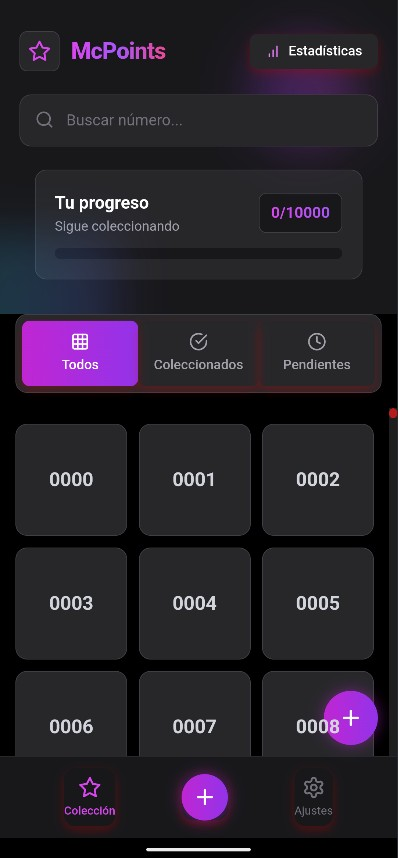

# 🍟 McPoints 🍔

**La mejor app para coleccionar números promocionales de McDonald's**

---

📱 DESCARGA DIRECTA - INSTALACIÓN MANUAL 📱

### [⬇️ Descargar APK v1.0.1](https://github.com/GabriLPDA22/mcpoints/releases/download/v1.0.1/MacPoints.apk)

## 📱 Interfaz Elegante y Moderna

  <kbd>
    
  </kbd>

## 📥 Instalación

1.  **Descarga el archivo APK** desde el enlace proporcionado arriba.
2.  **Habilita "Orígenes desconocidos"** (o "Instalar apps desconocidas") en la configuración de seguridad de tu dispositivo Android.
3.  **Abre el archivo APK descargado** y sigue las instrucciones en pantalla para instalar la aplicación.
4.  **¡Listo!** Abre McPoints y comienza a registrar tu colección inmediatamente.

> **⚠️ Advertencia de Seguridad Importante ⚠️**
>
> La aplicación **no posee un certificado digital**, por lo que durante la instalación, tu dispositivo Android puede mostrar una advertencia indicando un posible peligro o riesgo.
>
> Aunque aseguramos que la aplicación es segura (y puedes verificar el código fuente en este repositorio de GitHub si está disponible), la instalación de archivos APK de fuentes no oficiales siempre conlleva riesgos.
>
> **La instalación se realiza bajo tu propia responsabilidad.** Te recomendamos encarecidamente, por seguridad, verificar el archivo APK descargado utilizando servicios en línea como [VirusTotal](https://www.virustotal.com/) o [Koodous](https://koodous.com/) antes de proceder con la instalación.

> **Nota**: Esta aplicación no está disponible en Google Play ni App Store. Su distribución es exclusivamente independiente a través del archivo APK.

## 🚀 Características Espectaculares

<table>
  <tr>
    <td width="50%">
      <h3>🎯 Registro Completo</h3>
      
Visualiza y gestiona toda tu colección del 000 al 999 en una interfaz intuitiva diseñada para coleccionistas.

    </td>
    <td width="50%">
      <h3>📊 Estadísticas en Tiempo Real</h3>
      
Observa cómo tu colección crece con métricas detalladas que muestran tu progreso y logros.

    </td>
  </tr>
  <tr>
    <td width="50%">
      <h3>🔍 Búsqueda Instantánea</h3>
      
Localiza cualquier número en segundos con nuestro potente sistema de búsqueda y filtrado avanzado (todos, conseguidos, pendientes).

    </td>
    <td width="50%">
      <h3>💾 Guardado Local Seguro</h3>
      
Tu colección siempre está a salvo en tu dispositivo con guardado automático y opciones de exportación e importación.

    </td>
  </tr>
</table>

## 📷 Escaneo de Tickets (Opcional)

Usa la **función de escaneo** integrada para añadir números automáticamente a tu colección capturándolos desde los tickets con la cámara de tu dispositivo.

## 💎 Tecnología Destacada

| Característica         | Descripción                                                          |
| :--------------------- | :------------------------------------------------------------------- |
| **⚡ Rendimiento Máximo** | Optimizada para respuesta instantánea incluso con colecciones grandes. |
| **🔄 Datos Locales** | Tu progreso se guarda exclusivamente en tu dispositivo.               |
| **📷 Escaneo de Tickets** | Captura números promocionales directamente con la cámara (opcional). |
| **💯 Sin Dependencias** | No requiere registro, inicio de sesión ni conexión a internet.       |

## 🎨 Diseño Intuitivo

-   **Interfaz Moderna**: Sistema de diseño elegante y funcional.
-   **Navegación Simple**: Accede a cualquier función con un máximo de 2 toques.
-   **Filtros Potentes**: Visualiza tus números como prefieras: todos, conseguidos o pendientes.
-   **Totalmente Personalizable**: Adapta la experiencia a tus necesidades (si aplica).

## 🔧 Requisitos del Sistema

-   **Sistema Operativo**: Android 6.0 (Marshmallow) o superior.
-   **Almacenamiento**: Aproximadamente 50MB de espacio libre.
-   **Cámara**: Requerida únicamente si deseas utilizar la función de escaneo de tickets.

## ⚠️ Importante - Descargos de Responsabilidad

-   Esta aplicación **no está afiliada oficialmente con McDonald's Corporation** ni con ninguna de sus subsidiarias. Es un proyecto independiente.
-   La distribución se realiza **exclusivamente por canales independientes** (descarga directa de APK). No la encontrarás en tiendas de aplicaciones oficiales.
-   La aplicación **no recopila, almacena ni transmite datos personales** del usuario. Toda la información de la colección se guarda localmente.
-   Aplicación desarrollada con fines de **uso personal y para compartir con amigos** coleccionistas.

---

## 💫 Comparte McPoints

Si encuentras útil la aplicación, ¡no dudes en compartir el archivo APK con otros amigos coleccionistas!

---

## 📝 Licencia

Este proyecto está licenciado bajo la **Licencia MIT**. Consulta el archivo `LICENSE.md` (si se incluye en el repositorio) para más detalles.

*McPoints - Creado por coleccionistas, para coleccionistas.*

